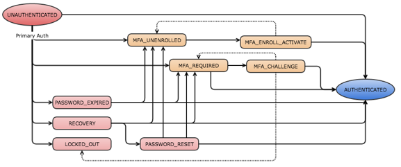

* Will be replaced with the ToC
{:toc .list-unstyled .toc}

## Overview

Multifactor authentication (MFA) provides an additional layer of security for your enterprise applications. The authentication API supports the MFA enrollment and authentication flows.

The goal of these flows is to obtain an authorization code. This authorization code can be exchanged for an access token. This exchange is uses calls from the Sessions API that exchange a one-time token for a session cookie. Your client app can use our existing APIs to trade the authorization code for a session cookie.

### Authentication Model

The current state of the authentication is tracked in a **stateToken**. This token is bound to the server-side status. The following table shows the possible values for this token.

##### stateToken 

Value|Description
-----|-----------
PASSWORD_EXPIRED|The user credentials are valid but expired; the user must change them with a POST to authn/credentials/change_password.
RECOVERY|The user is in the middle of a forgot-password flow.
PASSWORD_RESET|The user has answered their recovery question and needs to set a new password.
LOCKED_OUT|The user account is locked; self-service unlock or admin unlock is required.
MFA_UNENROLLED|The user credentials are valid, but MFA is required and no factors are set up yet.
MFA_ENROLL_ACTIVATE|The user enrolled in a MFA factor, but the factor requires activation.
MFA_REQUIRED|The user credentials are valid, but MFA is required.
MFA_CHALLENGE|The user needs to enter the passCode from their MFA factor.
SUCCESS|The user is authenticated.

Each of these statuses has an expiration date and a cancellation link which that deletes the stateToken and returns the user to the UNAUTHENTICATED state.

##### factorResult 

In addition to these state values, the MFA_CHALLENGE state can return an addition attribute **factorResult**. The following table shows the possible values for this attribute.

Value|Description
-----|-----------
WAITING|challenge request is being sent to device.
FAILED|passcode or challenge answer is wrong.
CANCELLED|verification request cancelled by user.
TIMEOUT|user did not respond within a specified time window.
TIME_WINDOW_EXCEEDED|The OTP you provided is within the Sync window, but outside the Look Ahead Window. This operation requires a second consecutive OTP.
PASSCODE_REPLAYED|The OTP has already been seen by the service.
ERROR|an unspecified error occurred during factor authentication; the corresponding "factorResultMessage" attribute should contain the details. 

##### Authentication State Flow

The following diagrams shows all the possible authentication state flows. Items in red all represent an unauthenticated state. Items in beige represent multi-factor authentication states. There is only one state for authentication in progress, shown in blue.

<ul><li>If a user enters the PASSWORD_EXPIRED state and then completes the processing to set a new password, the user can move into three possible states: (1) MFA_UNENROLLED if MFA is required, but the user is not enrolled in MFA, (2) MFA_REQUIRED if MFA is required, and the user is already enrolled in MFA, and (3) SUCCESS if MFA is not required and the user's authentication is in progress.</li>

<li>If a user enters the RECOVERY state to recover a forgotten password, the user can move directly into the three states described above for the PASSWORD_EXPIRED state or can enter a separate PASSWORD_RESET state first to match the UI flow.</li>

<li>If a user enters the LOCKED_OUT state, intervention is required.</li>

<li>If no MFA is required and the password is current, the user can move directly from unauthenticated to success.</li></ul>

Note that the dotted lines represent a "backwards" flow; that is, a flow into a previous state.

There are four very common flows, an enrollment flow, an authentication flow with a previously enrolled user, an expired password flow, and a forgotten password flow. Select any of the links below for code examples.

[Enrollment Flow](#enrollment-flow) – This flow moves through the following four areas: primary user authentication, MFA factor enrollment, challenge, and verification. After successful verification the user is authenticated.

[Authenticate a Previously Enrolled User](#authenticate-a-previously-enrolled-user) – This flow shows a user who is already enrolled in MFA and only needs complete the challenge phase. This example also illustrates how to request an ID token.

[Expired Password Flow](#expired-password-flow) – This flow is used if the user’s password is expired.

[Forgotten Password Flow](#forgotten-password-flow)  – This flow is used when a trusted user selects the forgotten password link.

### Get Basic Information

#### Get Info
{:.api .api-operation}

GET/api/v1/authn/info

Returns basic information and links. The user data that is returned is considered anonymous, as this API is run without user authentication.

##### Request Parameters

There are no request parameters.

#####Response Example
{:.api .api-response .api-response-example}

~~~json
HTTP/1.1 200 OK
Content-Type: application/json
 
{
    "id": "00oewwEGGIFFQTUCFCVJ",
    "name": "Rain-Cloud59",
    "status": "ACTIVE",
    "subdomain": "rain",
    "website": "http://clouditude.net:7890/",
    "technicalContact": "webmaster@clouditude.net",
    "_links": {
        "home": {
            "href": "http://rain.okta1.com:1802"
        },
        "logoUrl": {
            "href": "http://rain.okta1.com:1802/img/logos/okta-logo.png"
        },
        "forgotPassword": {
            "href": "http://rain.okta1.com:1802/api/v1/authn?forgot_password=true",
            "hints": {
                "allow": [ "POST" ]
            }
        },
        "help": {
            "href": "http://rain.okta1.com:1802/help/login"
        }
    }
}
~~~

### Enrollment Flow

The following flows use the /api/v1/authn endpoint to navigate through primary user authentication, MFA enrollment, challenge, and verification. There are also the special cases of password expired and forgot-password. The end result is either an authorization code which can be redeemed for a session, or an ID token, or both. We follow the same patterns as OpenID Connect for specifying the response type.

The client can optionally include some relay state on the URL or in the request body, with the *relayState* parameter. This parameter is echoed back in the response, and can be used anywhere along the chain for this API.

The client can force an MFA challenge, even if Okta's policies do not require it. Use the *force_mfa* parameter, if you want to force a challenge.

Parameter    | Description                     | Param Type | DataType | Required | Default
------------ | ------------------------------- | ---------- | -------- | -------- | -------
response_type | The type that contains the response. Valid types are `code`, `id_token`, and `code%20id_token`         | String     | String   | False    | `code`
force_mfa    | Forces an MFA challenge         | Boolean    | Boolean   | False   | False
relayState   | Optional relay state            | String     | String    | False   | None

#### Primary Authentication

The entry point into the authorization flow is a simple POST to the /api/v1/authn endpoint with the user's credentials. Optionally, the request can contain some client context and relay state.

{:.api .api-operation}

POST /api/v1/authn HTTP/1.1

##### Request Parameters
{:.api .api-request .api-request-params}

None.

##### Request Example
{:.api .api-request .api-request-example} 

~~~json
POST /api/v1/authn HTTP/1.1
Host: acme.okta.com
Authorization: SSWS xWA57AyBz5dyy1Xp7K2759A5820b8k2n
Accept: application/json
Content-Type: application/json
{
    "login": "user@example.com",
    "password": "Abcd1234",
    "relayState": "5Fij07bc0j",
    "context": {
        "ipAddress": "192.168.12.11",
        "userAgent": "Mozilla/5.0 (Macintosh; Intel Mac OS X 10_9_3)",
        "deviceToken": "26q43Ak9Eh04p7H6Nnx0m69JqYOrfVBY"
    }
}
~~~

**Note:** The device token should be a globally unique ID which identifies the device from which the user is accessing the service.

#####Response Example
{:.api .api-response .api-response-example}

In the response, a state token is presented and the status is `MFA_UNENROLLED`. 

~~~JSON
HTTP/1.1 200 OK
Content-Type: application/json
 
{
    "stateToken": "NzYxMDAxIiwKICJhdWQiOiAiczZCaGRSa3F0",
    "status": "MFA_UNENROLLED",
    "expiresAt" : "2014-04-17T19:59:19.000Z",
    "relayState": "5Fij07bc0j",
    "_embedded" : {
          "user": {
              "id": "00udnlQDVLVRIVXESCMZ",
              "lastLogin": "2014-06-06T05:47:17.000Z",
              "profile": {
                  "firstName": "Add-Min",
                  "lastName": "O'Cloudy Tud",
                  "login": "administrator1@clouditude.net",
              }
          },
          "factors": [
           {
                "factorType": "sms",
                "provider": "OKTA",
                "deviceTypes": [ "mobile" ],
                "_links": {
                    "logo": { "href": "https://okta.com/static/sms.png" },
                    "enroll": {
                        "href": "http://rain.okta1.com:1802/api/v1/authn/factors",
                        "hints": {
                            "allow": [ "POST" ]
                        }
                    }
                }
           },
           {
               "factorType": "totp",
               "provider":"OKTA",
               "deviceTypes":["smartphone:ios","smartphone:android","smartphone:blackberry"],
               "_links": {
                   "logo": { "href": "https://okta.com/static/okta-verify.png" },
                   "enroll": {
                        "href": "http://rain.okta1.com:1802/api/v1/authn/factors",
                        "hints": {
                            "allow": [ "POST" ]
                        }
                    }
               }
           }],
    },
    "_links": {
        "cancel": {
             "href": "/api/v1/authn/cancel",
             "hints": {
                "allow": [ "POST" ]
             }
        }
    }
}
~~~

#### Factor Enrollment

The user can now choose which factor to enroll in. The client should POST to one of the *enroll* links, depending on which factor is selected.

**Note:** When enrolling in a factor, there is an *activate* parameter which indicates whether  to enroll in the factor and activate it by sending out the activation code all in one step. The default is `true`, but you change behavior using this parameter. If the factor is not activated now, there is a *resend* link in the response below which can be followed to send the activation code.

What goes in the *profile* is specific to which factor you choose. The general requiremen

Type | General Requirement
---- | -------------------
SMS  | *phoneNumber*
TOTP | no profile entry required
Security Question |  *question* and *answer*

##### Request Example
{:.api .api-request .api-request-example} 

~~~JSON 
POST /api/v1/authn/factors?activate=true HTTP/1.1
Host: acme.okta.com
Authorization: SSWS xWA57AyBz5dyy1Xp7K2759A5820b8k2n
Accept: application/json
Content-Type: application/json
 
{
    "stateToken": "NzYxMDAxIiwKICJhdWQiOiAiczZCaGRSa3F0",
    "factorType": "sms",
    "provider": "OKTA",
    "deviceType": "mobile"
    "relayState": "5Fij07bc0j",
    "profile": {
        "name": "My Phone",
        "phoneNumber": "1-408-123-4567"
    }
}
~~~

##### Response Example
{:.api .api-response .api-response-example}
 
~~~JSON
HTTP/1.1 200 OK
Content-Type: application/json
 
{
    "id": "00fa0pazBD8AZNmHmbB5",
    "stateToken": "NzYxMDAxIiwKICJhdWQiOiAiczZCaGRSa3F0",
    "factorType": "sms",
    "status": "MFA_ENROLL_ACTIVATE",
    "expiresAt" : "2014-04-17T19:59:19.000Z",
    "relayState": "5Fij07bc0j",
    "_embedded" : {
         "user": {
              "id": "00udnlQDVLVRIVXESCMZ",
              "lastLogin": "2014-06-06T05:47:17.000Z",
              "profile": {
                  "firstName": "Add-Min",
                  "lastName": "O'Cloudy Tud",
                  "login": "administrator1@clouditude.net",
              }
          }
    },
    "_links": {
        "next": {
             "href": "/api/v1/authn/factors/00fa0pazBD8AZNmHmbB5/lifecycle/activate",
             "hints": {
                "allow": [ "POST" ]
             }
        },
        "prev": {
             "href": "/api/v1/authn/previous",
             "hints": {
                "allow": [ "POST" ]
             }
        },
        "resend": {
             "href": "/api/v1/authn/factors/00fa0pazBD8AZNmHmbB5/lifecycle/resend",
             "hints": {
                "allow": [ "POST" ]
             }
        },
        "cancel": { 
             "href": "/api/v1/authn/cancel",
             "hints": {
                 "allow": [ "POST" ]
             } 
        }
    }
}
~~~

The status is now `MFA_ENROLL_ACTIVATE`. The user now obtains some sort of enrollment key or passcode from their device and the client POSTs it back to finish the enrollment.
 
##### Request Example
{:.api .api-request .api-request-example} 

~~~JSON
POST /api/v1/authn/factors/00fa0pazBD8AZNmHmbB5/lifecycle/activate HTTP/1.1
Host: acme.okta.com
Authorization: SSWS xWA57AyBz5dyy1Xp7K2759A5820b8k2n
Accept: application/json
Content-Type: application/json
 
{
    "stateToken": "NzYxMDAxIiwKICJhdWQiOiAiczZCaGRSa3F0",
    "passCode": "123456",
    "relayState": "5Fij07bc0j"
}
~~~

**Note:**  If the security question factor were used, the attribute here would be `answer` instead of `passCode`.
 
##### Response Example
{:.api .api-response .api-response-example}
 
~~~JSON
HTTP/1.1 200 OK
Content-Type: application/json
 
{
    "status": "SUCCESS",
    "authCode": "08Aa6xn76LQVGsxC25xENmvyOSyWqMZK",
    "relayState": "5Fij07bc0j"
    "_embedded": {
        "user": {
              "id": "00udnlQDVLVRIVXESCMZ",
              "lastLogin": "2014-06-06T05:47:17.000Z",
              "profile": {
                  "firstName": "Add-Min",
                  "lastName": "O'Cloudy Tud",
                  "login": "administrator1@clouditude.net",
              }
          }
    }
}
~~~

The final result is a successful authentication that generates an `authCode` that can be passed to the Sessions API to get a session cookie; for example `https://acme.okta.com/login/sessionCookie?token=08Aa6xn76LQVGsxC25xENmvyOSyWqMZK`.

### Authenticate a Previously Enrolled User

This example shows a user who is already enrolled in MFA and only needs complete the challenge phase. This example also illustrates how to request an ID token. 

##### Request Example
{:.api .api-request .api-request-example} 

~~~JSON
POST /api/v1/authn?response_type=code%20id_token HTTP/1.1
Host: acme.okta.com
Authorization: SSWS xWA57AyBz5dyy1Xp7K2759A5820b8k2n
Accept: application/json
Content-Type: application/json
 
{
    "login": "user@example.com",
    "password": "Abcd1234",
    "relayState": "5Fij07bc0j",
    "context": {
        "ipAddress": "192.168.12.11",
        "userAgent": "Mozilla/5.0 (Macintosh; Intel Mac OS X 10_9_3)",
        "deviceToken": "26q43Ak9Eh04p7H6Nnx0m69JqYOrfVBY"
    }
}
~~~

The application passes the user credentials along with some context into the Okta /api/v1/authn endpoint.
 
##### Response Example
{:.api .api-response .api-response-example}
 
~~~JSON
HTTP/1.1 200 OK
Content-Type: application/json
 
{
    "stateToken": "NzYxMDAxIiwKICJhdWQiOiAiczZCaGRSa3F0",
    "status": "MFA_REQUIRED",
    "expiresAt": "2014-04-17T19:59:19.000Z",
    "relayState": "5Fij07bc0j",
    "_embedded": {
         "user": {
             "id": "00udnlQDVLVRIVXESCMZ",
             "lastLogin": "2014-06-06T05:47:17.000Z",
             "profile": {
                 "firstName": "Add-Min",
                 "lastName": "O'Cloudy Tud",
                 "login": "administrator1@clouditude.net",
             }
         },
         "factors": [
          {
             "id": "00ud4tVDDXYVKPXKVLCO",
             "factorType": "sms",
             "deviceType": "phone",
             "profile": {
                 "displayName": "My Phone",
                 "phoneNumber": "XXX-XXX-4567"
             },
             "_links": {
                 "logo": { "href": "https://okta.com/static/sms.png" },
                 "verify": { "href": "/api/v1/authn/factors/00ud4tVDDXYVKPXKVLCO/verify" }
             }
          },
          {
             "id": "00ud4tVDDXYVKPXKVLCO",
             "factorType": "totp",
             "deviceType": "tablet",
             "profile": {
                 "displayName": "My IPad",
             },
             "_links": {
                 "logo": { "href": "https://okta.com/static/verify.png" },
                 "verify": { "href": "/api/v1/authn/factors/01xy4tVDDXYVKPXKVLCA/verify" }
             }
          }
       ]
    },
    "_links": {
        "cancel": { 
            "href": "/api/v1/authn/cancel",
            "hints": {
                 "allow": [ "POST" ]
             }
        }
    }
}
~~~

A state token is generated, and the status is set to `MFA_REQUIRED`. This indicates that you have one or more enrolled factors. To choose which factor to use, follow the "verify" link for that factor. In this example we are POSTing to the SMS factor. At this time, there is no passcode to send. The operation only selects which factor to use. 

##### Request Example
{:.api .api-request .api-request-example} 

~~~JSON
POST /api/v1/authn/factors/01xy4tVDDXYVKPXKVLCA/verify HTTP/1.1
Host: acme.okta.com
Authorization: SSWS xWA57AyBz5dyy1Xp7K2759A5820b8k2n
Accept: application/json
Content-Type: application/json
 
{
    "stateToken": "NzYxMDAxIiwKICJhdWQiOiAiczZCaGRSa3F0",
    "relayState": "5Fij07bc0j"
}
~~~

##### Response Example
{:.api .api-response .api-response-example}
 
~~~JSON
HTTP/1.1 200 OK
Content-Type: application/json
 
{
    "stateToken": "NzYxMDAxIiwKICJhdWQiOiAiczZCaGRSa3F0",
    "status": "MFA_CHALLENGE",
    "expiresAt": "2014-04-17T19:59:19.000Z",
    "relayState": "5Fij07bc0j",
    "_embedded": {
        "user": {
              "id": "00udnlQDVLVRIVXESCMZ",
              "lastLogin": "2014-06-06T05:47:17.000Z",
              "profile": {
                  "firstName": "Add-Min",
                  "lastName": "O'Cloudy Tud",
                  "login": "administrator1@clouditude.net",
              }
          }
    },
    "_links": { 
        "next": {
              "href": "/api/v1/authn/factors/00ud4tVDDXYVKPXKVLCO/verify",
              "hints": {
                 "allow": [ "POST" ]
              } 
         },
        "prev": {
             "href": "/api/v1/authn/previous",
             "hints": {
                 "allow": [ "POST" ]
             }
        },
        "cancel": {
             "href": "/api/v1/authn/cancel",
             "hints": {
                 "allow": [ "POST" ]
             }
        }
    }
}
~~~

Now the status is `MFA_CHALLENGE`. At this point the SMS code has been sent. The the users sends it back for verification. Once you obtain the passcode, just POST it back to the same endpoint, as shown in the request below. 

For factors such as Okta Verify, this intermediate step is not necessary since there is no background code for Okta to send to the user. In those cases, you can just choose the factor and POST the passcode all in one step.
 
##### Request Example
{:.api .api-request .api-request-example} 

~~~JSON
POST /api/v1/authn/factors/01xy4tVDDXYVKPXKVLCA/verify HTTP/1.1
Host: acme.okta.com
Authorization: SSWS xWA57AyBz5dyy1Xp7K2759A5820b8k2n
Accept: application/json
Content-Type: application/json
 
{
    "stateToken": "NzYxMDAxIiwKICJhdWQiOiAiczZCaGRSa3F0",
    "passCode": "123456",
    "relayState": "5Fij07bc0j"
}
~~~

##### Response Example
{:.api .api-response .api-response-example}
 
~~~JSON
HTTP/1.1 200 OK
Content-Type: application/json
 
{
    "status": "SUCCESS",
    "relayState": "5Fij07bc0j"
    "authCode": "08Aa6xn76LQVGsxC25xENmvyOSyWqMZK",
    "id_token": "eyJpc3MiOiI3NjEzMjY3OTgwNjktcjVtbGpsbG4xcmQ0bHJiaGc3NWVmZ2lncDM2bTc4ajVAZGV2ZWxv
                 cGVyLmdzZXJ2aWNlYWNjb3VudC5jb20iLCJzY29wZSI6Imh0dHBzOi8vd3d3Lmdvb2dsZWFwaXMuY29t
                 L2F1dGgvcHJlZGljdGlvbiIsImF1ZCI6Imh0dHBzOi8vYWNjb3VudHMuZ29vZ2xlLmNvbS9vL29hdXRo
                 Mi90b2tlbiIsImV4cCI6MTMyODU1NDM4NSwiaWF0IjoxMzI4NTUwNzg1fQ",
    "_embedded": {
        "user": {
              "id": "00udnlQDVLVRIVXESCMZ",
              "lastLogin": "2014-06-06T05:47:17.000Z",
              "profile": {
                  "firstName": "Add-Min",
                  "lastName": "O'Cloudy Tud",
                  "login": "administrator1@clouditude.net",
              }
          }
    }
}
~~~

### StateToken Status – Polling Endpoint

The main /api/v1/authn endpoint can also act as a "token state" endpoint which can be used to check the current status of a given MFA state token. Instead of a username/password, POST a stateToken. The response provides the userId, status, expiration time, and next action for the token.

This example is useful in the following three use cases:

<ol><li>A client diverges from the flow for some reason and then comes back to it; they want to check exactly where they are at and figure out the next action.</li>
<li>The state token is about to expire and the client wants to keep it alive. POSTing to any of these endpoints including this one will reset the expiration time, which is 5 minutes by default.</li>
<li>For asynchronous uses cases, where the state changes in the background and the client needs to poll and check for it to change.</li></ol>

##### Request Example
{:.api .api-request .api-request-example} 

~~~JSON
POST /api/v1/authn HTTP/1.1
Host: acme.okta.com
Authorization: SSWS xWA57AyBz5dyy1Xp7K2759A5820b8k2n
Accept: application/json
Content-Type: application/json
 
{
    "stateToken": "NzYxMDAxIiwKICJhdWQiOiAiczZCaGRSa3F0",
    "relayState": "5Fij07bc0j"
}
~~~

##### Response Example
{:.api .api-response .api-response-example}
 
~~~JSON

HTTP/1.1 200 OK
Content-Type: application/json
 
{
    "stateToken": "NzYxMDAxIiwKICJhdWQiOiAiczZCaGRSa3F0",
    "status": "MFA_CHALLENGE",
    "expiresAt": "2014-04-17T19:59:19.000Z",
    "relayState": "5Fij07bc0j",
    "_embedded": {
        "user": {
              "id": "00udnlQDVLVRIVXESCMZ",
              "lastLogin": "2014-06-06T05:47:17.000Z",
              "profile": {
                  "firstName": "Add-Min",
                  "lastName": "O'Cloudy Tud",
                  "login": "administrator1@clouditude.net",
              }
          }
    },
    "_links": { 
        "next": {
              "href": "/api/v1/authn/factors/00ud4tVDDXYVKPXKVLCO/verify",
              "hints": {
                 "allow": [ "POST" ]
              }
         },
        "prev": {
             "href": "/api/v1/authn/previous",
             "hints": {
                 "allow": [ "POST" ]
             }
        },
        "cancel": {
             "href": "/api/v1/authn/cancel",
             "hints": {
                 "allow": [ "POST" ]
             }
        }
    }
}
~~~

### Expired Password Flow
The following examples show how the flow changes if the user's password is expired.

##### Request Example
{:.api .api-request .api-request-example} 

~~~JSON
POST /api/v1/authn HTTP/1.1
Host: acme.okta.com
Authorization: SSWS xWA57AyBz5dyy1Xp7K2759A5820b8k2n
Accept: application/json
Content-Type: application/json
 
{
    "login": "user@example.com",
    "password": "Abcd1234",
    "relayState": "5Fij07bc0j",
    "context": {
        "ipAddress": "192.168.12.11",
        "userAgent": "Mozilla/5.0 (Macintosh; Intel Mac OS X 10_9_3)",
        "deviceToken": "26q43Ak9Eh04p7H6Nnx0m69JqYOrfVBY"
    }
}
~~~

##### Response Example
{:.api .api-response .api-response-example}
 
~~~JSON
HTTP/1.1 200 OK
Content-Type: application/json
 
{
    "stateToken": "NzYxMDAxIiwKICJhdWQiOiAiczZCaGRSa3F0",
    "status": "PASSWORD_EXPIRED",
    "expiresAt": "2014-04-17T19:59:19.000Z",
    "relayState": "5Fij07bc0j",
    "_embedded": {
        "user": {
              "id": "00udnlQDVLVRIVXESCMZ",
              "lastLogin": "2014-06-06T05:47:17.000Z",
              "profile": {
                  "firstName": "Add-Min",
                  "lastName": "O'Cloudy Tud",
                  "login": "administrator1@clouditude.net",
              }
          }
    },
    "_links": {
        "next": {
              "href": "/api/v1/authn/credentials/change_password",
              "hints": {
                 "allow": [ "POST" ]
              }
         },
        "cancel": {
             "href": "/api/v1/authn/cancel",
             "hints": {
                 "allow": [ "POST" ]
             }
        }
    }
}
~~~

Here the app needs to obtain the previous password and new password from the user, and POST them to the /api/v1/authn/credentials/change_password endpoint.

##### Request Example
{:.api .api-request .api-request-example} 

~~~JSON
POST /api/v1/authn/credentials/change_password HTTP/1.1
Host: acme.okta.com
Authorization: SSWS xWA57AyBz5dyy1Xp7K2759A5820b8k2n
Accept: application/json
Content-Type: application/json
 
{
    "stateToken": "NzYxMDAxIiwKICJhdWQiOiAiczZCaGRSa3F0",
    "oldPassword": "Abcd1234",
    "newPassword": "1234Abcd",
    "relayState": "5Fij07bc0j"
}
~~~

This immediately moves the user into the next state (`MFA_UNENROLLED` or `MFA_REQUIRED`) or directly to the `SUCCESS` state if MFA is not enabled.

##### Response Example
{:.api .api-response .api-response-example}
 
~~~JSON
HTTP/1.1 200 OK
Content-Type: application/json
 
{
    "stateToken": "NzYxMDAxIiwKICJhdWQiOiAiczZCaGRSa3F0",
    "status": "MFA_REQUIRED",
    "expiresAt": "2014-04-17T19:59:19.000Z",
    "relayState": "5Fij07bc0j",
    "_embedded": {
       "user": {
              "id": "00udnlQDVLVRIVXESCMZ",
              "lastLogin": "2014-06-06T05:47:17.000Z",
              "profile": {
                  "firstName": "Add-Min",
                  "lastName": "O'Cloudy Tud",
                  "login": "administrator1@clouditude.net",
              }
       },
       "factors": [
        {
            "id": "00ud4tVDDXYVKPXKVLCO",
            "factorType": "sms",
            "deviceType": "phone",
            "profile": {
                "displayName": "My Phone",
                "phoneNumber": "XXX-XXX-4567"
            },
            "_links": {
                "logo": { "href": "https://okta.com/static/sms.png" },
                "next": { "href": "/api/v1/authn/factors/00ud4tVDDXYVKPXKVLCO/verify" }
            }
        },
        {
            "id": "00ud4tVDDXYVKPXKVLCO",
            "factorType": "totp",
            "deviceType": "tablet",
            "profile": {
                "displayName": "My IPad",
            },
            "_links": {
                "logo": { "href": "https://okta.com/static/verify.png" },
                "next": { "href": "/api/v1/authn/factors/01xy4tVDDXYVKPXKVLCA/verify" }
            }
        }
       ]
    },
    "_links": {
        "cancel": { "href": "/api/v1/authn/cancel" }
    }
}
~~~

At this point, the flow continues as before. The user must choose a verification factor, and then the app will receive an authorization code or an ID token. 

### Forgotten Password Flow

The System Info endpoint has a Forgot Password link which can be used to take a username and trigger the forgotten password flow. To use it, POST the username to the /authn endpoint using the *forgot_password* query parameter. 

**NOTE:** This flow assumes a trusted client, since it requires an API token. 

##### Request Example
{:.api .api-request .api-request-example} 

~~~JSON
POST /api/v1/authn?forgot_password=true HTTP/1.1
Host: acme.okta.com
Authorization: SSWS xWA57AyBz5dyy1Xp7K2759A5820b8k2n
Accept: application/json
Content-Type: application/json
 
{
    "login": "user@example.com",
    "relayState": "5Fij07bc0j",
    "context": {
        "ipAddress": "192.168.12.11",
        "userAgent": "Mozilla/5.0 (Macintosh; Intel Mac OS X 10_9_3)",
        "deviceId": "26q43Ak9Eh04p7H6Nnx0m69JqYOrfVBY"
    }
}
~~~

##### Response Example
{:.api .api-response .api-response-example}
 
~~~JSON
HTTP/1.1 200 OK
Content-Type: application/json
 
{
    "status": "RECOVERY",
    "recoveryToken": "zcAuL98F0DOtdrwK7I6iaz6nSXrK7cPJ",
    "relayState": "5Fij07bc0j",
    "_embedded": {
         "user": {
              "id": "00udnlQDVLVRIVXESCMZ",
              "lastLogin": "2014-06-06T05:47:17.000Z",
              "profile": {
                  "firstName": "John",
                  "lastName": "Smith",
                  "login": "user@example.com",
              }
        }
    },    
    "_links": {
        "next"  : { "name": "recovery", "href": "/api/v1/authn/recovery" },
        "send" : [ 
                   { 
                      "name": "sms",
                      "href": "/api/v1/authn/recovery/sms" 
                   },
                   {
                      "name": "call",
                      "href": "/api/v1/authn/recovery/call"
                   }
                ]
    }
}
~~~

This scenario presents the client with a recoveryToken to send  to the user in an email. Alternatively, if the org setting called "Users can reset password with SMS" is turned on **and**  the user has previously configured a phone number, there will be a SMS link to use to send a text to the user's phone with a one-time passcode. In both case, a recoveryToken or an SMS passCode, the user must tenter the code back into the client app, which POSTs it back to the /authn/recovery endpoint as shown below. 

##### Request Example
{:.api .api-request .api-request-example} 

~~~JSON
POST /api/v1/authn/recovery HTTP/1.1
Host: acme.okta.com
Authorization: SSWS xWA57AyBz5dyy1Xp7K2759A5820b8k2n
Accept: application/json
Content-Type: application/json
 
{
    "recoveryToken": "zcAuL98F0DOtdrwK7I6" [alternatively, in the future: "passCode" from SMS or voice call]
    "relayState": "5Fij07bc0j",
}
~~~

This redeems the recoveryCode or SMS passCode and presents the security question. If the recoveryToken or passCode is invalid, a 403 error is returned.

##### Response Example
{:.api .api-response .api-response-example}
 
~~~JSON
HTTP/1.1 200 OK
Content-Type: application/json
 
{
    "stateToken": "NzYxMDAxIiwKICJhdWQiOiAiczZCaGRSa3F0",
    "status": "RECOVERY",
    "expiresAt" : "2014-04-17T19:59:19.000Z",
    "relayState": "5Fij07bc0j",
    "_embedded" : {
          "user": {
              "id": "00udnlQDVLVRIVXESCMZ",
              "lastLogin": "2014-06-06T05:47:17.000Z",
              "profile": {
                  "firstName": "John",
                  "lastName": "Smith",
                  "login": "user@example.com",
              },
              "recovery_question": {
                 "question": "Who's a major player in the cowboy scene?"
              },
          }
    },
    "_links": {
        "next"  : { "name": "answer", href": "/api/v1/authn/recovery/answer" },
        "cancel": { "href": "/api/v1/authn/cancel" }
    }
}
~~~

**Note:** The response now has a stateToken, as a valid recoveryToken was presented and the user is now within the recovery flow. The stateToken is used to finish the recovery, as shown below.
 
The final step is to answer the security question and set a new password. This can be accomplished in one step or two, depending on the structure of the client UI.

##### Request Example
{:.api .api-request .api-request-example} 

~~~JSON
POST /api/v1/authn/recovery/answer HTTP/1.1
Host: acme.okta.com
Authorization: SSWS xWA57AyBz5dyy1Xp7K2759A5820b8k2n
Accept: application/json
Content-Type: application/json
 
{
    "stateToken": "NzYxMDAxIiwKICJhdWQiOiAiczZCaGRSa3F0",
    "answer": "Cowboy Dan"
}
~~~

In this example, just the security answer was posted, so the status moves to `PASSWORD_RESET` until the new password is also posted. It is allowable to post them both in the same request to /authn/recovery/answer.

##### Response Example
{:.api .api-response .api-response-example}
 
~~~JSON
HTTP/1.1 200 OK
Content-Type: application/json
  
{
    "stateToken": "NzYxMDAxIiwKICJhdWQiOiAiczZCaGRSa3F0",
    "status": "PASSWORD_RESET",
    "expiresAt" : "2014-04-17T19:59:19.000Z",
    "relayState": "5Fij07bc0j",
    "_links": {
        "next"  : { "name": "password", "href": "/api/v1/authn/credentials/reset_password" },
        "cancel": { "href": "/api/v1/authn/cancel" }
    }
}
~~~

##### Request Example
{:.api .api-request .api-request-example} 

~~~JSON
POST /api/v1/authn/credentials/reset_password HTTP/1.1
Host: acme.okta.com
Authorization: SSWS xWA57AyBz5dyy1Xp7K2759A5820b8k2n
Accept: application/json
Content-Type: application/json
 
{
    "stateToken": "NzYxMDAxIiwKICJhdWQiOiAiczZCaGRSa3F0",
    "newPassword": "NEW PASSWORD"
}
~~~

Now the password has been set and the authorization flow continues, either to `MFA_REQUIRED` or directly to `SUCCESS`.
 
 
##### Response Example
{:.api .api-response .api-response-example}
 
~~~JSON
HTTP/1.1 200 OK
Content-Type: application/json
  
{
    "stateToken": "NzYxMDAxIiwKICJhdWQiOiAiczZCaGRSa3F0",
    "status": "MFA_REQUIRED",
    "expiresAt": "2014-04-17T19:59:19.000Z",
    "relayState": "5Fij07bc0j",
    "_embedded": {
         "user": {
             "id": "00udnlQDVLVRIVXESCMZ",
             "lastLogin": "2014-06-06T05:47:17.000Z",
             "profile": {
                 "firstName": "John",
                 "lastName": "Smith",
                 "login": "user@example.com",
             }
         },
         "factors": [
          {
             "id": "00ud4tVDDXYVKPXKVLCO",
             "factorType": "sms",
             "deviceType": "phone",
             "profile": {
                 "displayName": "My Phone",
                 "phoneNumber": "XXX-XXX-4567"
             },
             "_links": {
                 "logo": { "href": "https://okta.com/static/sms.png" },
                 "next": { "href": "/api/v1/authn/factors/00ud4tVDDXYVKPXKVLCO/verify" }
             }
          },
          {
             "id": "00ud4tVDDXYVKPXKVLCO",
             "factorType": "totp",
             "deviceType": "tablet",
             "profile": {
                 "displayName": "My IPad",
             },
             "_links": {
                 "logo": { "href": "https://okta.com/static/verify.png" },
                 "next": { "href": "/api/v1/authn/factors/01xy4tVDDXYVKPXKVLCA/verify" }
             }
          }
       ]
    },
    "_links": {
        "cancel": { "href": "/api/v1/authn/cancel" }
    }
}
~~~

