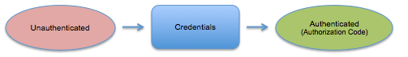
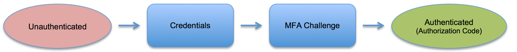
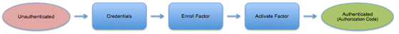
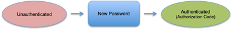
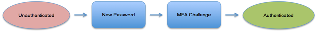
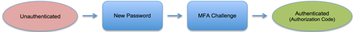

* Will be replaced with the ToC
{:toc .list-unstyled .toc}

## Overview

The Okta Auth API provides operations to authenticate users, perform MFA enrollment and challenge flows, recover forgotten passwords, and unlock accounts. It can be used as a standalone API to provide the identity layer on top of your existing application, or it can be integrated with the Okta Sessions API to obtain an Okta session cookie and access apps within Okta.

There are three types of functionality in this API.

- **Primary authentication** allows you to verify username and password credentials. Verifying these credentials is the only part of the functionality that starts outside of Okta.

- **Multifactor authentication** (MFA) provides an additional layer of security when authenticating users by requiring both the primary password and an additional factor such as a temporary, one-time password or an SMS passcode. The Auth API supports user enrollment in the various MFA factors enabled by the administrator, as well as the MFA challenge based on your security policy.

- **Recovery** allows users to securely reset their password if they've forgotten it, or unlock their account if it has been locked out due to excessive failed login attempts. This functionality is subject to the security policy set by the administrator.

   **Note:**The unlock user functionality in the Auth API is a user-initiated flow that includes sending a recovery token to the user that the user returns to the Auth API where it is redeemed for a security question. After the user answers the security question correctly, the user's account is unlocked. The unlock user functionality in the Users API allows an administrator to unlock a user's account directly. It is not a user-initiated flow.

   <a href="http://developer.okta.com/docs/api/rest/users.html#unlock-user">Unlock User </a> in the Users API.

> This API is currently in Beta status. The state model and data contracts will not change, but there may be additional attributes added to the JSON or minor semantic changes until the API reaches GA status.

## Authentication Model

The authentication flow uses a state machine and standard JSON HAL (*next* and *prev* links) to navigate through it. The current state is tracked in a state token, which is returned in each response and required to be passed back in on the next request. The following table shows the possible statuses for this token:

##### stateToken 

Value|Description
-----|-----------
PASSWORD_EXPIRED|The user credentials are valid but expired.
RECOVERY|The user is in the middle of a forgot-password flow.
PASSWORD_RESET|The user has answered their recovery question and needs to set a new password.
LOCKED_OUT|The user account is locked; self-service unlock or admin unlock is required.
MFA_UNENROLLED|The user credentials are valid, but MFA is required and no factors are set up yet.
MFA_ENROLL_ACTIVATE|The user enrolled in a MFA factor, but the factor requires activation.
MFA_REQUIRED|The user credentials are valid, but MFA is required.
MFA_CHALLENGE|The user needs to enter the passCode from their MFA factor.
SUCCESS|The user finished the authentication flow successfully.

Each of these statuses has an expiration date and a cancellation link which that deletes the stateToken and returns the user to the unauthenticated state. The current status of the state token is aways available by POSTing a stateToken to the /api/v1/authn endpoint, as described in the [stateToken Status](#stateToken-status) section.

##### factorResult 

In addition to these state values, the MFA_CHALLENGE state can return an addition attribute **factorResult**. The following table shows the possible values for this attribute.

Value|Description
-----|-----------
FAILED|passcode or challenge answer is wrong.
TIMEOUT|user did not respond within a specified time window.
PASSCODE_REPLAYED|The OTP has already been seen by the service.
ERROR|an unspecified error occurred during factor authentication; the corresponding "factorResultMessage" attribute should contain the details. 

## Use Cases

There are seven common use cases for the Authentication API that are detailed in the following section. Items in red all represent an unauthenticated state. Items in blue represent authentication processes. The goal of all flows is the authenticated state, shown in green. Most of these use cases use the **stateToken** and **factorResult** described in the [Authentication Model](#authentication-model) section. Use the following links to jump to a use case.

[Get Anonymous System Information](#get-anonymous-system-information) 
[Primary Authentication](#primary-authentication) 
[Authentication with an Enrolled MFA Factor](#authentication-with-an-enrolled-mfa-factor) 
[Authentication with an Unenrolled MFA Factor](#authentication-with-an-unenrolled-mfa-factor) 
[Expired Password Flow](#expired-password-flow) 
[Forgotten Password Flow](#forgotten-password-flow) 
[stateToken Status](#statetoken-status) 

### Get Anonymous System Information
{:.api .api-operation}

Returns basic information and links. The user data that is returned is considered anonymous, as this API is run without user authentication.

GET/api/v1/authn/info

##### Request Parameters

None.

##### Response Example
{:.api .api-response .api-response-example}

~~~json
HTTP/1.1 200 OK
Content-Type: application/json
 
{
    "id": "00oewwEGGIFFQTUCFCVJ",
    "name": your-domain08",
    "status": "ACTIVE",
    "subdomain": "your-domain",
    "website": "http://example.net/",
    "technicalContact": "webmaster@example.net",
    "_links": {
        "home": {
            "href": "http:/your-domain.okta.com"
        },
        "forgotPassword": {
            "href": "http:/your-domain.okta.com/api/v1/authn?forgot_password=true",
            "hints": {
                "allow": [ "POST" ]
            }
        },
        "help": {
            "href": "http:/your-domain.okta.com/help/login"
        }
    }
}
~~~

### Primary Authentication 

Primary authentication is always used to verify a username and password whether or not other MFA factors are used. Primary authentication is usually required. The only time it is not required is in certain utility APIs that are anonymous or use an existing state token.

The entry point into the authentication flow is a simple POST to the /api/v1/authn endpoint with the user's credentials. Optionally, the request can contain some client context and a relay state.

{:.api .api-operation}

POST /api/v1/authn HTTP/1.1

##### Request Parameters
{:.api .api-request .api-request-params}

Parameter   | Description                                                         | Param Type | DataType                          | Required | Default
----------- | ------------------------------------------------------------------- | ---------- | --------------------------------- | -------- | -------
username       | URL of the user to authenticate                                     | Body       | String                            | TRUE     |
password    | Password for the user to authenticate                               | Body       | String                            | TRUE     |
relayState  | An optional value to track this authentication                      | Body       | String                            | FALSE    |
context     | Optional values to track how this authentication is accessed        | Body       | [Context Object](#context-object) | FALSE 

###### Context Object

The Context Object tracks source of an authentication request.

Parameter   | Description                                                         | Param Type | DataType                          | Required | Default
----------- | ------------------------------------------------------------------- | ---------- | --------------------------------- | -------- | -------
ipAddress   | The address from which the request originates                       | Body       | String                            | FALSE    |
userAgent   | Agent and device information for the request                        | Body       | String                            | FALSE    |
deviceToken | A globally unique ID identifying the device making the request      | Body       | String                            | FALSE    |

##### Request Example
{:.api .api-request .api-request-example} 

~~~json
POST /api/v1/authn HTTP/1.1
Host: your-domain.okta.com
Authorization: SSWS yourtoken
Accept: application/json
Content-Type: application/json
{
    "username": "isaac@example.org",
    "password": "Abcd1234",
    "relayState": "5Fij07bc0j",
    "context": {
        "ipAddress": "192.168.12.11",
        "userAgent": "Mozilla/5.0 (Macintosh; Intel Mac OS X 10_9_3)",
        "deviceToken": "26q43Ak9Eh04p7H6Nnx0m69JqYOrfVBY"
    }
}
~~~

**Note:** The device token should be a globally unique ID which identifies the device from which the user is accessing the service.

##### Response Example
{:.api .api-response .api-response-example}

This basic response is for a user with no MFA required. See the following sections for other use cases. 

~~~JSON
HTTP/1.1 200 OK
Content-Type: application/json
 
{
    "status": "SUCCESS",
    "relayState": "5Fij07bc0j",
    "stateToken": "NzYxMDAxIiwKICJhdWQiOiAiczZCaGRSa3F0",
    "_embedded" : {
          "user": {
              "id": "00udnlQDVLVRIVXESCMZ",
              "profile": {
                  "username": "isaac@example.org",
                  "firstName": "Isaac",
                  "lastName": "Brock",
                  "locale": "en_US",
                  "timeZone": "America/Los_Angeles"
              }
          }
    }
}
~~~

### Authentication with an Enrolled MFA Factor 

This example shows a user who is already enrolled in MFA and needs to complete the challenge phase. The value of the state token is `MFA_REQUIRED` and reflects that the user is already enrolled in MFA. There are two enrolled factors in this example, a security question and SMS authentication.

##### Request Example
{:.api .api-request .api-request-example} 

~~~JSON
POST /api/v1/authn HTTP/1.1
Host: your-domain.okta.com
Authorization: SSWS yourtoken
Accept: application/json
Content-Type: application/json
 
{
    "username": "isaac@example.org",
    "password": "Abcd1234",
    "relayState": "5Fij07bc0j",
    "context": {
        "ipAddress": "192.168.12.11",
        "userAgent": "Mozilla/5.0 (Macintosh; Intel Mac OS X 10_9_3)",
        "deviceToken": "26q43Ak9Eh04p7H6Nnx0m69JqYOrfVBY"
    }
}
~~~

The application passes the user credentials along with some context into the Okta /api/v1/authn endpoint.
 
##### Response Example
{:.api .api-response .api-response-example}
 
~~~JSON
HTTP/1.1 200 OK
Content-Type: application/json
 
{
    "stateToken": "NzYxMDAxIiwKICJhdWQiOiAiczZCaGRSa3F0",
    "expiresAt": "2014-04-17T19:59:19.000Z",
    "status": "MFA_REQUIRED",
    "relayState": "5Fij07bc0j",
    "_embedded": {
         "user": {
             "id": "00udnlQDVLVRIVXESCMZ",
             "profile": {
                  "username": "isaac@example.org",
                  "firstName":"Isaac",
                  "lastName": "Brock",
                  "locale": "en_US",
                  "timeZone": "America/Los_Angeles"
             }
         },
        "factors": [
            {
                "id": "ufs2r3z6svTZWUFFNAKY",
                "factorType": "question",
                "provider": "OKTA",
                "profile": {
                    "question": "favorite_book_movie_character",
                    "questionText": "Who is your favorite book/movie character?"
                },
                "_links": {
                    "verify": {
                        "href": "http://your-domain.okta.com/api/v1/authn/factors/ufs2r3z6svTZWUFFNAKY/verify",
                        "hints": {
                            "allow": [
                                "POST"
                            ]
                        }
                    }
                }
            },
            {
                "id": "sms2r3z79aSQXYAARCIC",
                "factorType": "sms",
                "provider": "OKTA",
                "profile": {
                    "phoneNumber": "+1 XXX-XXX-5309"
                },
                "_links": {
                    "verify": {
                        "href": "http://your-domain.okta.com/api/v1/authn/factors/sms2r3z79aSQXYAARCIC/verify",
                        "hints": {
                            "allow": [
                                "POST"
                            ]
                        }
                    }
                }
            }
        ]
    },
    "_links": {
        "cancel": { 
            "href": "http://your-domain.okta.com/api/v1/authn/cancel",
            "hints": {
                 "allow": [ "POST" ]
             }
        }
    }
}
~~~

A state token is generated, and the status is set to `MFA_REQUIRED`. This indicates that there are one or more enrolled factors. To choose which factor to use, follow the "verify" link for that factor. In this example the request POSTs to the SMS factor. At this point in the flow, there is no passcode to send. The operation only selects which factor to use. 

##### Request Example
{:.api .api-request .api-request-example} 

~~~JSON
POST /api/v1/authn/factors/01xy4tVDDXYVKPXKVLCA/verify HTTP/1.1
Host: your-domain.okta.com
Authorization: SSWS yourtoken
Accept: application/json
Content-Type: application/json
 
{
    "stateToken": "NzYxMDAxIiwKICJhdWQiOiAiczZCaGRSa3F0",
    "relayState": "5Fij07bc0j"
}
~~~

##### Response Example
{:.api .api-response .api-response-example}
 
~~~JSON
HTTP/1.1 200 OK
Content-Type: application/json
 
{
    "stateToken": "NzYxMDAxIiwKICJhdWQiOiAiczZCaGRSa3F0",
    "expiresAt": "2014-04-17T19:59:19.000Z",
    "status": "MFA_CHALLENGE",
    "relayState": "5Fij07bc0j",
    "_embedded": {
        "user": {
              "id": "00udnlQDVLVRIVXESCMZ",
              "profile": {
                  "username": "isaac@example.org",
                  "firstName":"Isaac",
                  "lastName": "Brock",
                  "locale": "en_US",
                  "timeZone": "America/Los_Angeles"
              }
        },
        "factor": {
            "id": "sms2r3z79aSQXYAARCIC",
            "factorType": "sms",
            "provider": "OKTA",
            "profile": {
                "phoneNumber": "+1 XXX-XXX-5709"
             }
         }
    },
    "_links": { 
        "next": {
              "name": "verify"
              "href": "http://your-domain.okta.com/api/v1/authn/factors/00ud4tVDDXYVKPXKVLCO/verify",
              "hints": {
                 "allow": [ "POST" ]
              } 
         },
        "cancel": {
             "href": "http://your-domain.okta.com/api/v1/authn/cancel",
             "hints": {
                 "allow": [ "POST" ]
             }
        }
        "prev": {
             "href": "http://your-domain.okta.com/api/v1/authn/previous",
             "hints": {
                 "allow": [ "POST" ]
             }
        }
    }
}
~~~

Now, the status is `MFA_CHALLENGE`. At this point the SMS code has been sent. Next, the user sends it back for verification. Once you obtain the passcode, POST it back to the same endpoint, as shown in the request below. 

For factors such as Okta Verify, this intermediate step is not necessary since there is no background code for Okta to send to the user. In those cases, you can just choose the factor and POST the passcode all in one step.
 
##### Request Example
{:.api .api-request .api-request-example} 

~~~JSON
POST /api/v1/authn/factors/01xy4tVDDXYVKPXKVLCA/verify HTTP/1.1
Host: your-domain.okta.com
Authorization: SSWS yourtoken
Accept: application/json
Content-Type: application/json
 
{
    "stateToken": "NzYxMDAxIiwKICJhdWQiOiAiczZCaGRSa3F0",
    "passCode": "123456",
    "relayState": "5Fij07bc0j"
}
~~~

##### Response Example
{:.api .api-response .api-response-example}
 
~~~JSON
HTTP/1.1 200 OK
Content-Type: application/json
 
{
    "status": "SUCCESS",
    "relayState": "5Fij07bc0j"
    "authCode": "08Aa6xn76LQVGsxC25xENmvyOSyWqMZK",
    "id_token": "eyJpc3MiOiI3NjEzMjY3OTgwNjktcjVtbGpsbG4xcmQ0bHJiaGc3NWVmZ2lncDM2bTc4ajVAZGV2ZWxv
                 cGVyLmdzZXJ2aWNlYWNjb3VudC5jb20iLCJzY29wZSI6Imh0dHBzOi8vd3d3Lmdvb2dsZWFwaXMuY29t
                 L2F1dGgvcHJlZGljdGlvbiIsImF1ZCI6Imh0dHBzOi8vYWNjb3VudHMuZ29vZ2xlLmNvbS9vL29hdXRo
                 Mi90b2tlbiIsImV4cCI6MTMyODU1NDM4NSwiaWF0IjoxMzI4NTUwNzg1fQ",
    "_embedded": {
        "user": {
              "id": "00udnlQDVLVRIVXESCMZ",
              "profile": {
                  "username": "isaac@example.org",
                  "firstName":"Isaac",
                  "lastName": "Brock",
                  "locale": "en_US",
                  "timeZone": "America/Los_Angeles"
              }
          }
    }
}
~~~

### Authentication with an Unenrolled MFA Factor 

The following flow begins with primary authentication that returns a status of MFA_UNENROLLED. This status indicates that MFA is enabled for the user, but the user is not registered for any factors.

The client can optionally include some relay state on the URL or in the request body, with the *relayState* attribute. This attribute is echoed back in the response, and can be used anywhere along the chain for this API.

The client can force an MFA challenge, even if Okta's policies do not require it. Use the *force_mfa* query parameter, if you want to force a challenge.

Attribute    | Description                     | Type                | DataType | Required | Default
------------ | ------------------------------- | ------------------- | -------- | -------- | -------
force_mfa    | Forces an MFA challenge         | URL query parameter | Boolean   | FALSE   | FALSE
relayState   | Optional relay state            | JSON attribute      | String    | FALSE   | None

#### Primary Authentication

The entry point into the authorization flow is a simple POST to the /api/v1/authn endpoint with the user's credentials. This entry point is the same for several use cases. Optionally, the request can contain some client context and relay state.

{:.api .api-operation}

POST /api/v1/authn HTTP/1.1

##### Request Parameters
{:.api .api-request .api-request-params}

None.

##### Request Example
{:.api .api-request .api-request-example} 

~~~json
POST /api/v1/authn HTTP/1.1
Host: your-domain.okta.com
Authorization: SSWS yourtoken
Accept: application/json
Content-Type: application/json
{
    "username": "isaac@example.org",
    "password": "Abcd1234",
    "relayState": "5Fij07bc0j",
    "context": {
        "ipAddress": "192.168.12.11",
        "userAgent": "Mozilla/5.0 (Macintosh; Intel Mac OS X 10_9_3)",
        "deviceToken": "26q43Ak9Eh04p7H6Nnx0m69JqYOrfVBY"
    }
}
~~~

**Note:** The device token should be a globally unique ID which identifies the device from which the user is accessing the service.

#####Response Example
{:.api .api-response .api-response-example}

In the response, a state token is presented and the status is `MFA_UNENROLLED`.  All the possible factors into which you can enroll the user are returned.

~~~JSON
HTTP/1.1 200 OK
Content-Type: application/json
 
{
    "stateToken": "NzYxMDAxIiwKICJhdWQiOiAiczZCaGRSa3F0",
    "expiresAt" : "2014-04-17T19:59:19.000Z",
    "status": "MFA_UNENROLLED",
    "relayState": "5Fij07bc0j",
    "_embedded" : {
          "user": {
              "id": "00udnlQDVLVRIVXESCMZ",
              "profile": {
                  "username": "isaac@example.org",
                  "firstName":"Isaac",
                  "lastName": "Brock",
                  "locale": "en_US",
                  "timeZone": "America/Los_Angeles"
              }
          },
          "factors": [
              {
                "factorType": "question",
                "provider": "OKTA",
                "_links": {
                    "questions": {
                        "href": "https://your-domain.okta.com/api/v1/users/00u2r3z7cmFGLPBJSQRD/factors/questions",
                        "hints": {
                            "allow": [
                                "GET"
                            ]
                        }
                    },
                    "enroll": {
                        "href": "https://your-domain.okta.com/api/v1/authn/factors",
                        "hints": {
                            "allow": [
                                "POST"
                            ]
                        }
                    }
                }
            },
            {
                "factorType": "token:software:totp",
                "provider": "OKTA",
                "_links": {
                    "enroll": {
                        "href": "https://your-domain.okta.com/api/v1/authn/factors",
                        "hints": {
                            "allow": [
                                "POST"
                            ]
                        }
                    }
                }
            },
            {
                "factorType": "token:software:totp",
                "provider": "GOOGLE",
                "_links": {
                    "enroll": {
                        "href": "https://your-domain.okta.com/api/v1/authn/factors",
                        "hints": {
                            "allow": [
                                "POST"
                            ]
                        }
                    }
                }
            },
            {
                "factorType": "sms",
                "provider": "OKTA",
                "_links": {
                    "enroll": {
                        "href": "https://your-domain.okta.com/api/v1/authn/factors",
                        "hints": {
                            "allow": [
                                "POST"
                            ]
                        }
                    }
                }
            }
        ]
    },
    "_links": {
        "cancel": {
             "href": "https://your-domain.okta.com/api/v1/authn/cancel",
             "hints": {
                "allow": [ "POST" ]
             }
        }
    }
}
~~~

#### Factor Enrollment

The user can now choose which factor to enroll in. The client should POST to one of the *enroll* links, depending on which factor is selected.

**Note:** When enrolling in a factor, there is an *activate* parameter which indicates whether  to enroll in the factor and activate it by sending out the activation code all in one step. The default is `true`, but you change behavior using this parameter. If the factor is not activated now, there is a *resend* link in the response below which can be followed to send the activation code.

What goes in the *profile* is specific to which factor you choose, as shown in the following table.

Type | General Requirement
---- | -------------------
SMS  | *phoneNumber*
TOTP | no profile entry required
Security Question |  *question* and *answer*

##### Request Example
{:.api .api-request .api-request-example} 

~~~JSON 
POST /api/v1/authn/factors HTTP/1.1
Host: your-domain.okta.com
Authorization: SSWS yourtoken
Accept: application/json
Content-Type: application/json
 
{
    "stateToken": "NzYxMDAxIiwKICJhdWQiOiAiczZCaGRSa3F0",
    "factorType": "sms",
    "provider": "OKTA",
    "deviceType": "mobile"
    "relayState": "5Fij07bc0j",
    "profile": {
        "name": "My Phone",
        "phoneNumber": "1-408-123-4567"
    }
}
~~~

##### Response Example
{:.api .api-response .api-response-example}
 
~~~JSON
HTTP/1.1 200 OK
Content-Type: application/json
 
{
    "id": "00fa0pazBD8AZNmHmbB5",
    "stateToken": "NzYxMDAxIiwKICJhdWQiOiAiczZCaGRSa3F0",
    "factorType": "sms",
    "status": "MFA_ENROLL_ACTIVATE",
    "expiresAt" : "2014-04-17T19:59:19.000Z",
    "relayState": "5Fij07bc0j",
    "_embedded" : {
         "user": {
              "id": "00udnlQDVLVRIVXESCMZ",
              "lastLogin": "2014-06-06T05:47:17.000Z",
              "profile": {
                  "username": "isaac@example.org",
                  "firstName":"Isaac",
                  "lastName": "Brock",
                  "locale": "en_US",
                  "timeZone": "America/Los_Angeles"
              }
          }
    },
    "_links": {
        "next": {
             "name": "activate",
             "href": "https://your-domain.okta.com/api/v1/authn/factors/00fa0pazBD8AZNmHmbB5/lifecycle/activate",
             "hints": {
                "allow": [ "POST" ]
             }
        },
        "prev": {
             "href": "https://your-domain.okta.com/api/v1/authn/previous",
             "hints": {
                "allow": [ "POST" ]
             }
        },
        "resend": {
             "href": "https://your-domain.okta.com/api/v1/authn/factors/00fa0pazBD8AZNmHmbB5/lifecycle/resend",
             "hints": {
                "allow": [ "POST" ]
             }
        },
        "cancel": { 
             "href": "https://your-domain.okta.com/api/v1/authn/cancel",
             "hints": {
                 "allow": [ "POST" ]
             } 
        }
    }
}
~~~

The status is now `MFA_ENROLL_ACTIVATE`. The user now obtains some sort of enrollment key or passcode from their device and the client POSTs it back to finish the enrollment using the reference in the activate link.
 
##### Request Example
{:.api .api-request .api-request-example} 

~~~JSON
POST /api/v1/authn/factors/00fa0pazBD8AZNmHmbB5/lifecycle/activate HTTP/1.1
Host: your-domain.okta.com
Authorization: SSWS yourtoken
Accept: application/json
Content-Type: application/json
 
{
    "stateToken": "NzYxMDAxIiwKICJhdWQiOiAiczZCaGRSa3F0",
    "passCode": "123456",
    "relayState": "5Fij07bc0j"
}
~~~

**Note:**  If the security question factor were used, the attribute here would be `answer` instead of `passCode`.
 
##### Response Example
{:.api .api-response .api-response-example}
 
~~~JSON
HTTP/1.1 200 OK
Content-Type: application/json
 
{
    "status": "SUCCESS",
    "authCode": "08Aa6xn76LQVGsxC25xENmvyOSyWqMZK",
    "relayState": "5Fij07bc0j"
    "_embedded": {
        "user": {
              "id": "00udnlQDVLVRIVXESCMZ",
              "lastLogin": "2014-06-06T05:47:17.000Z",
              "profile": {
                  "userame": "isaac@example.org",
                  "firstName": "Isaac",
                  "lastName": "Brock",
                  "locale": "en_US",
                  "timeZone": "America/Los_Angeles"
              }
          }
    }
}
~~~

The final result is a successful authentication that generates an `authCode` that can be passed to the Sessions API to get a session cookie; for example `https://your-domain.okta.com/login/sessionCookie?token=08Aa6xn76LQVGsxC25xENmvyOSyWqMZK`.

### Expired Password Flow

The following examples show how the flow changes if the user's password is expired.

##### Request Example
{:.api .api-request .api-request-example} 

~~~JSON
POST /api/v1/authn HTTP/1.1
Host: your-domain.okta.com
Authorization: SSWS xWA57AyBz5dyy1Xp7K2759A5820b8k2n
Accept: application/json
Content-Type: application/json
 
{
    "username": "isaac@example.org",
    "password": "Abcd1234",
    "relayState": "5Fij07bc0j",
    "context": {
        "ipAddress": "192.168.12.11",
        "userAgent": "Mozilla/5.0 (Macintosh; Intel Mac OS X 10_9_3)",
        "deviceToken": "26q43Ak9Eh04p7H6Nnx0m69JqYOrfVBY"
    }
}
~~~

##### Response Example
{:.api .api-response .api-response-example}
 
~~~JSON
HTTP/1.1 200 OK
Content-Type: application/json
 
{
    "stateToken": "NzYxMDAxIiwKICJhdWQiOiAiczZCaGRSa3F0",
    "status": "PASSWORD_EXPIRED",
    "expiresAt": "2014-04-17T19:59:19.000Z",
    "relayState": "5Fij07bc0j",
    "_embedded": {
        "user": {
              "id": "00udnlQDVLVRIVXESCMZ",
              "lastLogin": "2014-06-06T05:47:17.000Z",
              "profile": {
                  "username": "isaac@example.org",
                  "firstName":"Isaac",
                  "lastName": "Brock",
                  "locale": "en_US",
                  "timeZone": "America/Los_Angeles"
              }
          }
    },
    "_links": {
        "next": {
              "name": "change_password",
              "href": "https://your-domain.okta.com/api/v1/authn/credentials/change_password",
              "hints": {
                 "allow": [ "POST" ]
              }
         },
        "cancel": {
             "href": "https://your-domain.okta.com/api/v1/authn/cancel",
             "hints": {
                 "allow": [ "POST" ]
             }
        }
    }
}
~~~

Next, the app obtains the previous password and new password from the user, and POSTs them to the /api/v1/authn/credentials/change_password endpoint.

##### Request Example
{:.api .api-request .api-request-example} 

~~~JSON
POST /api/v1/authn/credentials/change_password HTTP/1.1
Host: your-domain.okta.com
Authorization: SSWS yourtoken
Accept: application/json
Content-Type: application/json
 
{
    "stateToken": "NzYxMDAxIiwKICJhdWQiOiAiczZCaGRSa3F0",
    "oldPassword": "Abcd1234",
    "newPassword": "1234Abcd",
    "relayState": "5Fij07bc0j"
}
~~~

This immediately moves the user into the next state (`MFA_UNENROLLED` or `MFA_REQUIRED`) or directly to the `SUCCESS` state if MFA is not enabled.

##### Response Example
{:.api .api-response .api-response-example}
 
~~~JSON
HTTP/1.1 200 OK
Content-Type: application/json
 
{
    "stateToken": "NzYxMDAxIiwKICJhdWQiOiAiczZCaGRSa3F0",
    "status": "MFA_REQUIRED",
    "expiresAt": "2014-04-17T19:59:19.000Z",
    "relayState": "5Fij07bc0j",
    "_embedded": {
       "user": {
              "id": "00udnlQDVLVRIVXESCMZ",
              "profile": {
                  "username": "isaac@example.org",
                  "firstName":"Isaac",
                  "lastName": "Brock",
                  "locale": "en_US",
                  "timeZone": "America/Los_Angeles"
              }
       },
       "factors": [
        {
            "id": "00ud4tVDDXYVKPXKVLCO",
            "factorType": "sms",
            "deviceType": "phone",
            "profile": {
                "displayName": "My Phone",
                "phoneNumber": "XXX-XXX-4567"
            },
            "_links": {
                "next": { 
                   "name": "verify",
                   "href": "https://your-domain.okta.com/api/v1/authn/factors/00ud4tVDDXYVKPXKVLCO/verify" 
                 }
            }
        },
        {
            "id": "00ud4tVDDXYVKPXKVLCO",
            "factorType": "totp",
            "deviceType": "tablet",
            "profile": {
                "displayName": "My IPad",
            },
            "_links": {
                "next": { 
                   "name": "activate", 
                   "href": "https://your-domain.okta.com/api/v1/authn/factors/01xy4tVDDXYVKPXKVLCA/verify"
                    }
            }
        }
       ]
    },
    "_links": {
        "cancel": { "href": "https://your-domain.okta.com/api/v1/authn/cancel" }
    }
}
~~~

At this point, the flow continues as before. The user must choose a verification factor, and then the app receives an authorization code or an ID token. 

### Forgotten Password Flow

The System Info endpoint has a Forgot Password link which can be used to take a username and trigger the forgotten password flow. To use it, POST the username to the /authn endpoint using the *forgot_password* query parameter. 

**NOTE:** This flow assumes a trusted client, as it requires an API token. 

##### Request Example
{:.api .api-request .api-request-example} 

~~~JSON
POST /api/v1/authn/recovery/password HTTP/1.1
Host: your-domain.okta.com
Authorization: SSWS yourtoken
Accept: application/json
Content-Type: application/json
 
{
    "username": "isaac@example.org",
    "relayState": "5Fij07bc0j",
    "context": {
        "ipAddress": "192.168.12.11",
        "userAgent": "Mozilla/5.0 (Macintosh; Intel Mac OS X 10_9_3)",
        "deviceId": "26q43Ak9Eh04p7H6Nnx0m69JqYOrfVBY"
    }
}
~~~

##### Response Example
{:.api .api-response .api-response-example}
 
~~~JSON
HTTP/1.1 200 OK
Content-Type: application/json
 
{
    "status": "RECOVERY",
    "recoveryToken": "zcAuL98F0DOtdrwK7I6iaz6nSXrK7cPJ",
    "relayState": "5Fij07bc0j",
    "_embedded": {
         "user": {
              "id": "00udnlQDVLVRIVXESCMZ",
              "profile": {
                  "username": "isaac@example.org",
                  "firstName":"Isaac",
                  "lastName": "Brock",
                  "locale": "en_US",
                  "timeZone": "America/Los_Angeles"
              }
        }
    },    
    "_links": {
        "next"  : { 
           "name": "recovery", 
           "href": "https://your-domain.okta.com/api/v1/authn/recovery" 
        },
        "send" : [ 
                   { 
                      "name": "sms",
                      "href": "https://your-domain.okta.com/api/v1/authn/recovery/sms" 
                   },
                   {
                      "name": "call",
                      "href": "https://your-domain.okta.com/api/v1/authn/recovery/call"
                   }
                ]
    }
}
~~~

This scenario presents the client with a recoveryToken to send  to the user in an email. Alternatively, if the org setting called "Users can reset password with SMS" is turned on **and**  the user has previously configured a phone number, there will be a SMS link to use to send a text to the user's phone with a one-time passcode. In both case, a recoveryToken or an SMS passCode, the user must tenter the code back into the client app, which POSTs it back to the /authn/recovery endpoint as shown below. 

##### Request Example
{:.api .api-request .api-request-example} 

~~~JSON
POST /api/v1/authn/recovery HTTP/1.1
Host: your-domain.okta.com
Authorization: SSWS yourtoken
Accept: application/json
Content-Type: application/json
 
{
    "recoveryToken": "zcAuL98F0DOtdrwK7I6" 
    "relayState": "5Fij07bc0j",
}
~~~

This redeems the recoveryCode or SMS passCode and presents the security question. If the recoveryToken or passCode is invalid, a 403 error is returned.

##### Response Example
{:.api .api-response .api-response-example}
 
~~~JSON
HTTP/1.1 200 OK
Content-Type: application/json
 
{
    "stateToken": "NzYxMDAxIiwKICJhdWQiOiAiczZCaGRSa3F0",
    "status": "RECOVERY",
    "expiresAt" : "2014-04-17T19:59:19.000Z",
    "relayState": "5Fij07bc0j",
    "_embedded" : {
          "user": {
              "id": "00udnlQDVLVRIVXESCMZ",
              "profile": {
                  "username": "isaac@example.org",
                  "firstName":"Isaac",
                  "lastName": "Brock",
                  "locale": "en_US",
                  "timeZone": "America/Los_Angeles"
              },
              "recovery_question": {
                 "question": "Who's a major player in the cowboy scene?"
              },
          }
    },
    "_links": {
        "next"  : { "name": "answer", href": "https://your-domain.okta.com/api/v1/authn/recovery/answer" },
        "cancel": { "href": "https://your-domain.okta.com/api/v1/authn/cancel" }
    }
}
~~~

**Note:** The response now has a stateToken, as a valid recoveryToken was presented and the user is now within the recovery flow. The stateToken is used to finish the recovery, as shown below.
 
The final step is to answer the security question and set a new password. This can be accomplished in one step or two, depending on the structure of the client UI.

##### Request Example
{:.api .api-request .api-request-example} 

~~~JSON
POST /api/v1/authn/recovery/answer HTTP/1.1
Host: your-domain.okta.com
Authorization: SSWS yourtoken
Accept: application/json
Content-Type: application/json
 
{
    "stateToken": "NzYxMDAxIiwKICJhdWQiOiAiczZCaGRSa3F0",
    "answer": "Cowboy Dan"
}
~~~

In this example, just the security answer was posted, so the status moves to `PASSWORD_RESET` until the new password is also posted. It is allowable to post them both in the same request to /authn/recovery/answer.

##### Response Example
{:.api .api-response .api-response-example}
 
~~~JSON
HTTP/1.1 200 OK
Content-Type: application/json
  
{
    "stateToken": "NzYxMDAxIiwKICJhdWQiOiAiczZCaGRSa3F0",
    "status": "PASSWORD_RESET",
    "expiresAt" : "2014-04-17T19:59:19.000Z",
    "relayState": "5Fij07bc0j",
    "_links": {
        "next"  : { "name": "password", "href": "https://your-domain.okta.com/api/v1/authn/credentials/reset_password" },
        "cancel": { "href": "https://your-domain.okta.com/api/v1/authn/cancel" }
    }
}
~~~

##### Request Example
{:.api .api-request .api-request-example} 

~~~JSON
POST /api/v1/authn/credentials/reset_password HTTP/1.1
Host: your-domain.okta.com
Authorization: SSWS yourtoken
Accept: application/json
Content-Type: application/json
 
{
    "stateToken": "NzYxMDAxIiwKICJhdWQiOiAiczZCaGRSa3F0",
    "newPassword": "NEW PASSWORD"
}
~~~

Now the password has been set and the authorization flow continues, either to `MFA_REQUIRED` or directly to `SUCCESS`.
 
 
##### Response Example
{:.api .api-response .api-response-example}
 
~~~JSON
HTTP/1.1 200 OK
Content-Type: application/json
  
{
    "stateToken": "NzYxMDAxIiwKICJhdWQiOiAiczZCaGRSa3F0",
    "status": "MFA_REQUIRED",
    "expiresAt": "2014-04-17T19:59:19.000Z",
    "relayState": "5Fij07bc0j",
    "_embedded": {
         "user": {
             "id": "00udnlQDVLVRIVXESCMZ",
             "profile": {
                  "username": "isaac@example.org",
                  "firstName":"Isaac",
                  "lastName": "Brock",
                  "locale": "en_US",
                  "timeZone": "America/Los_Angeles"
             }
         },
         "factors": [
          {
             "id": "00ud4tVDDXYVKPXKVLCO",
             "factorType": "sms",
             "deviceType": "phone",
             "profile": {
                 "displayName": "My Phone",
                 "phoneNumber": "XXX-XXX-4567"
             },
             "_links": {
                 "next": { "href": "https://your-domain.okta.com/api/v1/authn/factors/00ud4tVDDXYVKPXKVLCO/verify" }
             }
          },
          {
             "id": "00ud4tVDDXYVKPXKVLCO",
             "factorType": "totp",
             "deviceType": "tablet",
             "profile": {
                 "displayName": "My IPad",
             },
             "_links": {
                 "next": { "href": "https://your-domain.okta.com/api/v1/authn/factors/01xy4tVDDXYVKPXKVLCA/verify" }
             }
          }
       ]
    },
    "_links": {
        "cancel": { "href": "https://your-domain.okta.com/api/v1/authn/cancel" }
    }
}
~~~

### stateToken Status
{:.api .api-operation}

The main /api/v1/authn endpoint can also act as a "token state" endpoint which can be used to check the current status of a given MFA state token. Instead of a username/password, POST a stateToken. The response provides the userId, status, expiration time, and next action for the token.

This example is useful in the following three use cases:

<ol><li>A client diverges from the flow for some reason and then comes back to it; they want to check exactly where they are at and figure out the next action.</li>
<li>The state token is about to expire and the client wants to keep it alive. POSTing to any of these endpoints including this one will reset the expiration time, which is 5 minutes by default.</li>
<li>For asynchronous uses cases, where the state changes in the background and the client needs to poll and check for it to change.</li></ol>

POST/api/v1/authn

##### Request Example
{:.api .api-request .api-request-example} 

~~~JSON
POST /api/v1/authn HTTP/1.1
Host: your-domain.okta.com
Authorization: SSWS yourtoken
Accept: application/json
Content-Type: application/json
 
{
    "stateToken": "NzYxMDAxIiwKICJhdWQiOiAiczZCaGRSa3F0",
    "relayState": "5Fij07bc0j"
}
~~~

##### Response Example
{:.api .api-response .api-response-example}
 
~~~JSON

HTTP/1.1 200 OK
Content-Type: application/json
 
{
    "stateToken": "NzYxMDAxIiwKICJhdWQiOiAiczZCaGRSa3F0",
    "status": "MFA_CHALLENGE",
    "expiresAt": "2014-04-17T19:59:19.000Z",
    "relayState": "5Fij07bc0j",
    "_embedded": {
        "user": {
              "id": "00udnlQDVLVRIVXESCMZ",
              "profile": {
                  "username": "isaac@example.org",
                  "firstName":"Isaac",
                  "lastName": "Brock",
                  "locale": "en_US",
                  "timeZone": "America/Los_Angeles"
              }
          }
    },
    "_links": { 
        "next": {
              "name": "verify",
              "href": "https://your-domain.okta.com/api/v1/authn/factors/00ud4tVDDXYVKPXKVLCO/verify",
              "hints": {
                 "allow": [ "POST" ]
              }
         },
        "prev": {
             "href": "https://your-domain.okta.com/api/v1/authn/previous",
             "hints": {
                 "allow": [ "POST" ]
             }
        },
        "cancel": {
             "href": "https://your-domain.okta.com/api/v1/authn/cancel",
             "hints": {
                 "allow": [ "POST" ]
             }
        }
    }
}
~~~

